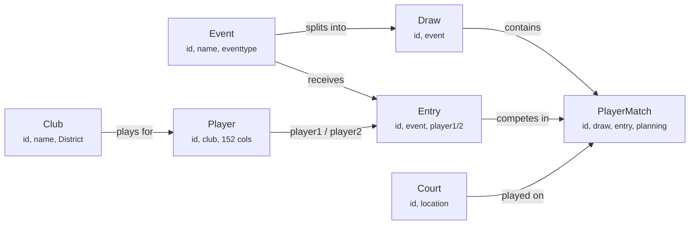
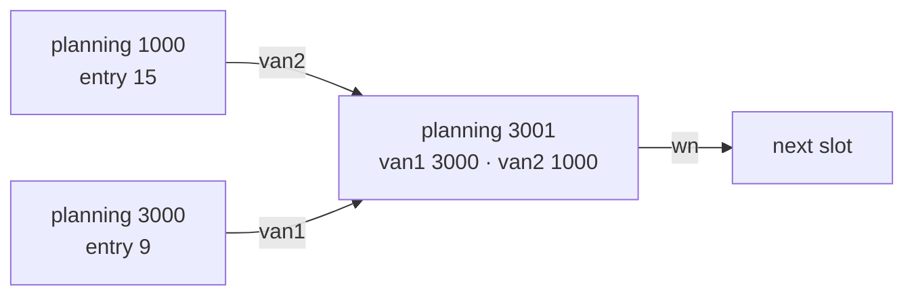

# The .TP file format

Reverse-engineered notes on the Badminton Tournament Planner file format
(Visual Reality / toernooi.nl, **BTP 2026.3**).

A `.TP` file is a **Microsoft Jet 4 (Access 2000) database** with the extension
renamed. In 2026.3 it holds **70 tables**.

| | |
|---|---|
| Format | Microsoft Jet 4 / Access 2000 (`.mdb`) |
| Tables | 70 in 2026.3 · 47 in the bundled 2007 demo |
| Declared foreign keys | 13 |
| Widest tables | `Player` 152 columns · `PlayerMatch` 67 columns |
| Password | Jet database password set — blocks writes, not reads |

---

## Reading the file

`mdbtools` reads a `.TP` without any password, because Jet's header
obfuscation is weak:

```bash
mdb-tables -1 "NW Doppelturnier 26-27.TP"     # list tables
mdb-schema "NW Doppelturnier 26-27.TP"        # full DDL
mdb-export "NW Doppelturnier 26-27.TP" Player # dump a table as CSV
mdb-export "NW Doppelturnier 26-27.TP" MSysRelationships   # declared FKs
```

**Writing is not available.** Microsoft's own providers refuse the file:

```
Microsoft.ACE.OLEDB.16.0 : Not a valid password.
Microsoft.ACE.OLEDB.12.0 : Not a valid password.
```

and mdbtools has no write tooling at all — every binary it ships is a dumper.
Treat this schema as read-and-understand, not read-write. Change data through
the application, or through its own `Tournament → Import Tournament Data`.

> Opening a `.TP` in Tournament Planner rewrites the file (Access compaction),
> so `git status` shows it modified even with zero edits. Close the app before
> `git checkout -- <file>`.

---

## The core model

Seven tables carry the competition. Everything else is reference data,
scheduling, money or logging hung off this spine.



Arrows run from the one side to the many. An **event** (e.g. `Doppel A`) splits
into **draws**; players enter as **entries** — one row per pair in doubles — and
every **match** belongs to a draw and points at the entries playing it.

---

## Draw brackets do not link by `id`

This is the trap. You would expect `PlayerMatch` rows to reference each other by
primary key. They do not — **joining `van1` to `PlayerMatch.id` returns zero
rows.**

The bracket tree is built on `planning`, a slot number unique *within a draw*.
The column names are Dutch, because Visual Reality is:

| Column | Dutch | Meaning |
|---|---|---|
| `planning` | — | this match's slot number in the draw |
| `van1`, `van2` | *van* = from | the two slots feeding this match |
| `wn` | *winnaar naar* | slot the winner advances to |
| `vn` | *verliezer naar* | slot the loser drops to (consolation / playoff) |



**To walk a bracket, join on the composite pair:**

```sql
child.van1 = parent.planning AND child.draw = parent.draw
```

Verified across the demo file: `(draw, planning)` is unique over all 60 match
rows, and that pairing resolves **every** reference — 39/39 for `van1`, 39/39
for `van2`, 32/32 for `wn`, 6/6 for `vn`.

---

## Declared vs. assumed relationships

Access stores real constraints in `MSysRelationships`, and that table is
readable. Only these 13 are enforced:

| Relationship name | Foreign key |
|---|---|
| `ClubTeam` | `Player.club` → `Club.id` |
| `TeamEntry` | `Entry.player1` → `Player.id` |
| `KlasseEntry` | `Entry.event` → `Event.id` |
| `KlassePoule` | `Draw.event` → `Event.id` |
| `DrawTeamWedstrijd` | `PlayerMatch.draw` → `Draw.id` |
| `EntryTeamWedstrijd` | `PlayerMatch.entry` → `Entry.id` |
| `CourtTeamMatch` | `PlayerMatch.court` → `Court.id` |
| `LinkTeamMatch` | `PlayerMatch.link` → `Link.id` |
| `LocationCourt` | `Court.location` → `Location.id` |
| `CourtTypeCourt` | `Court.courttype` → `CourtType.id` |
| `TeamMatchMatchOfficial` | `MatchOfficial.match` → `PlayerMatch.id` |
| `OfficialMatchOfficial` | `MatchOfficial.official` → `Official.ID` |
| `OfficialFunctionMatchOfficial` | `MatchOfficial.function` → `OfficialFunction.id` |

Everything else is naming convention. These were verified by checking that
child values actually resolve to parent keys in a populated file:

| Convention relationship | Refs | Resolved |
|---|---:|---:|
| `Entry.player2` → `Player.id` | 5 | 5 |
| `PlayerMatch.event` → `Event.id` | 2 | 2 |
| `PlayerMatch.winner` → `Entry.id` | 2 | 2 |
| `Court.playermatch` → `PlayerMatch.id` | 2 | 2 |
| `Payment.player` → `Player.id` | 10 | 10 |
| `Player.level1` / `level2` → `PlayerLevel.ID` | 2 | 2 |
| `Player.country` → `Country.ID` | 2 | 2 |
| `TournamentTime.location` → `Location.id` | 1 | 1 |
| `PlayerMatch.van1` / `van2` → `PlayerMatch.planning` | 78 | 78 |
| `PlayerMatch.wn` / `vn` → `PlayerMatch.planning` | 38 | 38 |

---

## Traps

- **`TournamentTime.TournamentDay` is not a foreign key.** It stores a *date
  value*. Zero of its 17 values resolve to `TournamentDay.id`.
- **Primary key casing is inconsistent.** `id` on most tables, but `ID` on
  `Country`, `Official`, `PlayerLevel` and several 2026 additions. Column case
  varies too (`PlayerMatch.Court` vs `Court.courttype`), so anything
  case-sensitive needs a mapping layer.
- **`Availability` is polymorphic** — an `objecttype` discriminator plus a bare
  `objectid`, with nothing constraining it.
- **Dutch vocabulary survives in relationship names.** *Klasse* = event,
  *poule* = group, *wedstrijd* = match. Useful when a column name makes no
  sense in English.

---

## Table inventory

| Area | Count | Tables |
|---|---:|---|
| Tournament setup | 10 | `Location` `Court` `CourtType` `TournamentDay` `TournamentTime` `TournamentInformation` `Settings` `SettingsFloat` `SettingsMemo` `PrintSettings` |
| Competition structure | 10 | `Event` `Draw` `stage` `eventpart` `League` `drawformat` `drawformatitem` `ScoringFormat` `seedingrule` `seedingruleitem` |
| People & reference | 15 | `Player` `Club` `District` `Country` `PlayerLevel` `PlayerlevelEntry` `PlayerRatingEntry` `playerwtn` `playerutr` `RankingCategory` `RankingEntry` `RatingSection` `ParaClass` `Official` `OfficialFunction` |
| Entries | 8 | `Entry` `stageentry` `onlineentry` `Entryformitem` `Playerentryformitem` `Withdrawal` `Replacement` `Availability` |
| Matches | 9 | `PlayerMatch` `MatchOfficial` `MatchWarning` `CodeViolation` `Link` `fixture` `fixtureitem` `fixturetemplate` `fixturetemplateitem` |
| Scheduling | 7 | `OrderOfPlay` `OrderOfPlayItem` `OrderOfPlayCourt` `eventschedule` `eventscheduleblock` `eventscheduleitem` `tournamentschedule` |
| Money | 4 | `Payment` `Income` `eventprizemoney` `playerprizemoney` |
| Comms & system | 7 | `Message` `MessageMatch` `mailtemplate` `Notes` `Log` `usagelog` `files` |

---

## Schema drift, 2007 → 2026

**23 tables added, none removed.** The core is untouched, so code written
against the old shape still reads the new one. `PlayerMatch` gained 4 columns,
`Player` gained 10.

The additions cluster in three places:

- **A stage layer** between event and draw — `stage`, `stageentry`,
  `eventpart`, `drawformat`, `drawformatitem`, `seedingrule`, `seedingruleitem`
- **External rating feeds** — `playerwtn` (World Tour Numbers), `playerutr`,
  `PlayerRatingEntry`, `PlayerlevelEntry`
- **Online entry and publishing** — `onlineentry`, `TournamentInformation`,
  `mailtemplate`, `files`, `usagelog`

---

## Files

- [`tp_schema_2026.sql`](tp_schema_2026.sql) — full DDL for all 70 tables, with
  declared and verified foreign keys annotated at the top.

Sources: `Demo.tp` (2007, fully populated — 14 players, 23 entries, 60 match
rows) and `NW Doppelturnier 26-27.TP` (2026.3).
